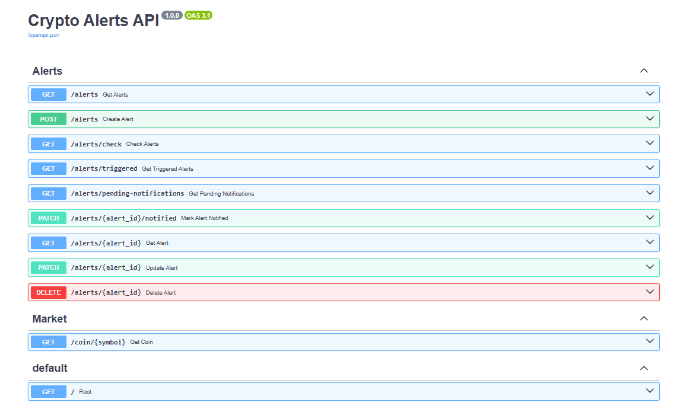
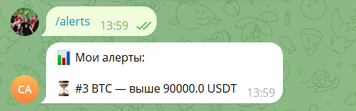
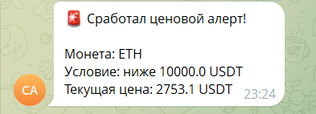

# 🚨 Crypto Alerts API

Backend-сервис для мониторинга цен криптовалют и отправки уведомлений в Telegram.

Проект получает актуальные цены через Bybit API, хранит ценовые алерты в PostgreSQL и автоматически проверяет их в фоновом режиме. Когда цена достигает заданного уровня, пользователь получает уведомление в Telegram.

## 🌐 Live Demo

Swagger API:

https://fastapi-crypto-alerts-production.up.railway.app/docs

## 📸 Screenshots

### Swagger API



### Telegram — список алертов



### Telegram — сработавший алерт



## 🚀 Возможности

- Получение актуальной цены криптовалют через Bybit API
- Поддержка Spot и USDT Perpetual
- Создание ценовых алертов
- Изменение и удаление алертов
- PostgreSQL для хранения данных
- SQLAlchemy ORM
- Alembic migrations
- Автоматическая проверка цен в background worker
- Фиксация времени срабатывания алерта
- Защита от повторной отправки уведомлений
- Telegram-уведомления
- Управление алертами из Telegram
- Swagger / OpenAPI документация
- Развёртывание на Railway
- Работа 24/7 без локального компьютера

## 🤖 Telegram команды

Посмотреть текущие алерты:

```text
/alerts
```

Создать алерт:

```text
/add BTC 90000 above
```

или:

```text
/add ETH 2500 below
```

Удалить алерт:

```text
/delete 3
```

## 📩 Пример уведомления

```text
🚨 Сработал ценовой алерт!

Монета: BTC
Условие: выше 90000 USDT
Текущая цена: 90125.4 USDT
```

## ⚙️ Как работает сервис

```text
Bybit API
    ↓
Background Worker
    ↓
Проверка ценовых условий
    ↓
PostgreSQL
    ↓
Telegram Bot
    ↓
Уведомление пользователю
```

Worker автоматически проверяет активные алерты.

После срабатывания:

```text
is_triggered = true
triggered_at = время срабатывания
```

После успешной отправки сообщения:

```text
notified_at = время отправки
```

Благодаря этому одно и то же уведомление не отправляется повторно.

## 🛠 Технологии

- Python
- FastAPI
- Pydantic
- SQLAlchemy
- PostgreSQL
- Alembic
- Psycopg
- HTTPX
- Uvicorn
- Telegram Bot API
- Bybit API
- Railway
- Git
- GitHub

## 📁 Структура проекта

```text
fastapi-crypto-alerts/
│
├── alembic/
│   └── versions/
│
├── routers/
│   ├── alerts.py
│   └── coins.py
│
├── services/
│   ├── alert_worker.py
│   ├── bybit.py
│   ├── telegram.py
│   └── telegram_commands.py
│
├── database.py
├── main.py
├── models.py
├── schemas.py
├── requirements.txt
├── alembic.ini
├── .env.example
└── README.md
```

## 🔌 Основные API endpoints

```text
GET    /coin/{symbol}

GET    /alerts
POST   /alerts
GET    /alerts/{alert_id}
PATCH  /alerts/{alert_id}
DELETE /alerts/{alert_id}

GET    /alerts/check
GET    /alerts/triggered
GET    /alerts/pending-notifications
PATCH  /alerts/{alert_id}/notified
```

## 🔐 Environment variables

Секреты не хранятся в GitHub.

Пример `.env`:

```env
DB_USER=
DB_PASSWORD=
DB_HOST=
DB_PORT=5432
DB_NAME=

TELEGRAM_BOT_TOKEN=
TELEGRAM_CHAT_ID=
```

Файл `.env` должен быть добавлен в `.gitignore`.

## 🗄 Database migrations

Для управления схемой PostgreSQL используется Alembic.

Применение миграций:

```bash
alembic upgrade head
```

При запуске production-сервиса миграции применяются перед стартом FastAPI.

## ☁️ Deployment

Проект развёрнут на Railway.

Production включает:

- FastAPI service
- PostgreSQL database
- background alert worker
- Telegram command worker

Приложение продолжает мониторинг цен даже при выключенном локальном компьютере.

## 🎯 Цель проекта

Проект создан как практический backend-проект для изучения и демонстрации навыков:

- разработки REST API
- работы с внешними API
- PostgreSQL
- ORM
- database migrations
- background tasks
- Telegram Bot API
- деплоя production-приложения
- работы с Git и GitHub

## 👨‍💻 Author

GitHub: **madebyromandev**